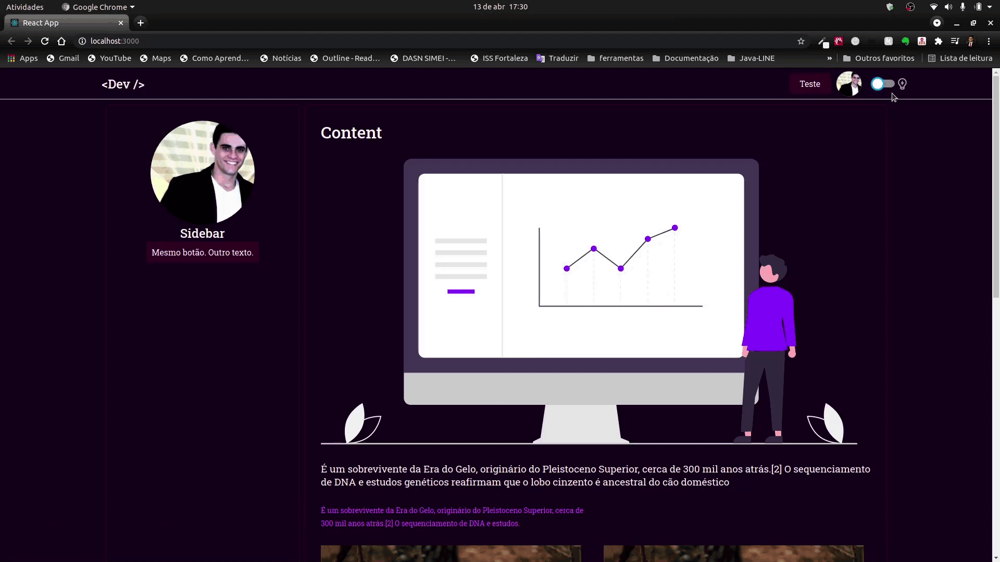

<small style="color: red">
  ! < Under construction />
  <br/>
  ! < not applied Design UI for this study >
</small>

# React Context API App

This project was built to reinforce and practice some concepts related to:

- Context API
- Darck/light theme
- overwrite DefaultTheme's interface
- Component reuse
- Stylize ready-made component via styled-components from another component

## Demo



## Running locally

```sh
cd react-context-api/

#install packages
yarn

# start the project
yarn start


# Runs the app in the development mode.\
# Open http://localhost:3000 to view it in the browser.

```

